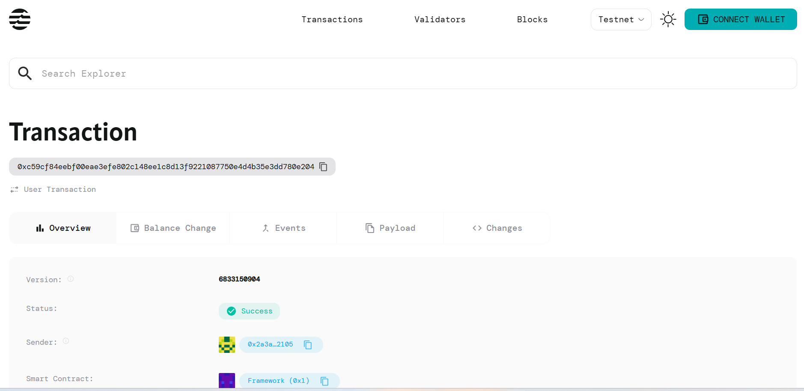

# Signature Utilities

A simple Aptos Move smart contract for signature generation and verification helpers.

## Overview

This smart contract provides essential cryptographic signature utilities on the Aptos blockchain, enabling secure message signing and verification using Ed25519 cryptography.

## Features

- **Signature Generation**: Store signed message data with cryptographic proof
- **Signature Verification**: Verify message authenticity against stored signatures
- **SHA3-256 Hashing**: Secure message hashing for integrity
- **Timestamp Tracking**: Record when signatures were generated

## Contract Functions

### 1. `generate_signature`
```move
public entry fun generate_signature(
    account: &signer,
    message: vector<u8>,
    signature: vector<u8>,
    public_key: vector<u8>,
)
```
- **Purpose**: Generate and store signature data for a message
- **Parameters**:
  - `account`: Signer account to store the signature data
  - `message`: Original message bytes to be signed
  - `signature`: Ed25519 signature bytes
  - `public_key`: Public key bytes for verification
- **Behavior**: Hashes the message and stores signature data with timestamp

### 2. `verify_signature`
```move
public fun verify_signature(
    account_addr: address,
    message: vector<u8>,
): bool
```
- **Purpose**: Verify a message against stored signature data
- **Parameters**:
  - `account_addr`: Address containing stored signature data
  - `message`: Message bytes to verify
- **Returns**: `true` if signature is valid, `false` otherwise
- **Behavior**: Compares message hash and performs Ed25519 verification

## Usage Example

```move
// Generate a signature (off-chain signing required)
signature_utilities::signature_utils::generate_signature(
    &signer,
    b"Hello, Aptos!",
    signature_bytes,
    public_key_bytes
);

// Verify the signature
let is_valid = signature_utilities::signature_utils::verify_signature(
    account_address,
    b"Hello, Aptos!"
);
```

## Deployment

1. Compile the contract:
   ```bash
   aptos move compile
   ```

2. Deploy to Aptos network:
   ```bash
   aptos move publish
   ```

## Security Notes

- Uses Ed25519 cryptographic standard for signature verification
- Messages are hashed using SHA3-256 for integrity
- Only one signature per account (overwrites previous signatures)
- Requires proper off-chain signature generation before calling `generate_signature`

## Error Codes

- `E_INVALID_SIGNATURE (1)`: Invalid signature provided
- `E_INVALID_PUBLIC_KEY (2)`: Invalid public key format

## License

MIT License

## Contract Details

0xc59cf84eebf00eae3efe802c148ee1c8d13f9221087750e4d4b35e3dd780e204

